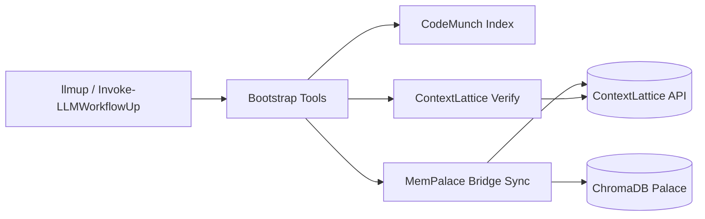

# Improvement Proposals — CodeMunch · ContextLattice · MemPalace All-in-One

After a deep read of every file in the project, here are concrete suggestions organized by category.

---

## 1. New Features

### 1a · Scheduled / Watch-mode Sync ⭐ High Impact
**Status:** The bridge (`sync_mempalace_to_contextlattice.py`) is run manually or via `llmup`.  
**Proposal:** Add a `--watch` / `--schedule` mode that continuously tails the MemPalace collection for new drawers and syncs them in near-real-time.

- Implementation: a Python `asyncio` loop (or PowerShell `Register-ObjectEvent` with a timer) that calls the existing batch logic on an interval.
- New module command: `Start-LLMWorkflowSync -IntervalSeconds 30` (alias `llmsync`).
- Graceful shutdown on `Ctrl+C`, writes state on exit.

**Effort:** Medium · **Priority:** High

---

### 1b · Bi-directional Bridge (ContextLattice → MemPalace)
**Status:** Bridge is strictly one-way (MemPalace → ContextLattice).  
**Proposal:** Add `sync_contextlattice_to_mempalace.py` to pull new memories written directly to ContextLattice back into the local ChromaDB palace.

- Enables a "round-trip" where AI agents writing to ContextLattice via MCP have their outputs archived locally.
- New flag: `llmup -SyncBack`.

**Effort:** Medium-High · **Priority:** Medium

---

### 1c · Interactive TUI Dashboard
**Status:** All output is plain `Write-Output` text.  
**Proposal:** Build a rich terminal UI (using `PSReadLine` color codes, or a small `Spectre.Console`-based .NET call) for `llm-workflow-doctor`:

- Color-coded pass/warn/fail checks with ✅❌⚠️ glyphs.
- Live-updating status during bootstrap (spinner while installing deps).
- Tabular summary at the end.

**Effort:** Medium · **Priority:** Medium

---

### 1d · Multi-Project Profile System
**Status:** Each project gets its own `.env` / `.contextlattice/` / `.memorybridge/` config discovered at bootstrap.  
**Proposal:** Allow named profiles stored centrally in `~/.llm-workflow/profiles/`:

```
~/.llm-workflow/profiles/
  work.env
  personal.env
  gaming-mods.env
```

- `llmup -Profile work` loads the matching profile before project-local `.env`.
- Useful when the same user works on projects that target different ContextLattice instances or providers.

**Effort:** Low-Medium · **Priority:** Medium

---

### 1e · Plugin / Extension Architecture
**Status:** The three tool chains (codemunch, contextlattice, memorybridge) are hard-coded in the bootstrap.  
**Proposal:** Introduce a plugin manifest (`.llm-workflow/plugins.json`) so third-party tools can register:

```json
{
  "plugins": [
    {
      "name": "code-review-agent",
      "bootstrapScript": "tools/code-review/bootstrap.ps1",
      "runOn": ["bootstrap", "check"]
    }
  ]
}
```

- Bootstrap iterates `plugins` after the built-in tool chains.
- Future-proofs the toolkit without needing new flags for every integration.

**Effort:** Medium · **Priority:** Low-Medium

---

### 1f · `llmup init` — Guided Interactive Setup
**Status:** Bootstrap creates sample configs but the user must manually edit them.  
**Proposal:** Add `Initialize-LLMWorkflow` (alias `llminit`) that interactively prompts:

1. Which provider? (pick from list)
2. Paste your API key → writes `.env`
3. ContextLattice URL → writes `.contextlattice/orchestrator.env`
4. Verify connectivity → runs doctor
5. Optionally run first MemPalace sync

This dramatically lowers onboarding friction.

**Effort:** Low-Medium · **Priority:** High

---

### 1g · Anthropic / Claude Provider Support
**Status:** Provider roster is: OpenAI, Kimi, Gemini, GLM.  
**Proposal:** Add `claude` provider profile:

```powershell
"claude" {
    return @{
        Name = "claude"
        ApiKeyVars = @("ANTHROPIC_API_KEY", "CLAUDE_API_KEY")
        BaseUrlVars = @("ANTHROPIC_BASE_URL")
        DefaultBaseUrl = "https://api.anthropic.com/v1"
    }
}
```

Also add `ollama` for local model users (base URL typically `http://localhost:11434/v1`).

**Effort:** Low · **Priority:** High

---

## 2. Feature Upgrades to Existing Commands

### 2a · `Update-LLMWorkflow` — In-place Git Pull Mode
**Status:** `Update-LLMWorkflow` downloads a release zip from GitHub.  
**Proposal:** Add a `-Source git` mode that does `git pull` + re-runs `install-module.ps1` for users who cloned the repo. The current zip-download approach is great for published releases, but repo contributors need the git flow.

**Effort:** Low · **Priority:** Medium

---

### 2b · `Test-LLMWorkflowSetup` — Version Checks for Dependencies
**Status:** Checks presence of `python`, `codemunch-pro`, `chromadb` but not their **versions**.  
**Proposal:** Add version constraint checking:

- `chromadb >= 0.5.0` (already in `compatibility.lock.json` but not enforced)
- `python >= 3.10`
- `codemunch-pro >= X.Y.Z`

A new check like `python_version` with status `warn` if below minimum.

**Effort:** Low · **Priority:** Medium

---

### 2c · Bridge Sync — Retry with Exponential Backoff
**Status:** `sync_mempalace_to_contextlattice.py` does one `_post_json` per drawer with no retry.  
**Proposal:** Add retry logic (3 attempts, exponential backoff) around the `_post_json` call on line 291. Particularly important for intermittent network issues during large syncs.

**Effort:** Low · **Priority:** Medium

---

### 2d · Bridge Sync — Parallel Writes
**Status:** Writes are sequential, one `_post_json` at a time.  
**Proposal:** Use `concurrent.futures.ThreadPoolExecutor` with a configurable `--workers N` (default 4) to parallelize writes. This could dramatically speed up large syncs.

**Effort:** Medium · **Priority:** Medium

---

### 2e · `llm-workflow-doctor` — Latency Reporting
**Status:** Doctor checks pass/fail for connectivity.  
**Proposal:** Report response times:

```
[OK] contextlattice_health: 127.0.0.1:8075/health ok=true (23ms)
[OK] contextlattice_status: service=contextlattice (45ms)
```

Helps diagnose slow network or overloaded servers.

**Effort:** Low · **Priority:** Low

---

### 2f · Structured JSON Logging for All Commands
**Status:** Only `doctor` has `-AsJson`. Bootstrap and check use plain text output.  
**Proposal:** Add `-AsJson` / `-OutputFormat json` to `Invoke-LLMWorkflowUp` and `Test-LLMWorkflowSetup`. Enables machine-readable output for CI pipelines and other tooling.

**Effort:** Medium · **Priority:** Medium

---

## 3. Code Quality / DRY Refactoring

### 3a · Extract Shared Utility Module ⭐
**Status:** `Import-EnvFile`, `Get-FirstEnvValue`, `Get-ProviderProfile`, `Resolve-ProviderProfile`, and `Test-PythonImport` are **copy-pasted** across:
- [bootstrap-llm-workflow.ps1](file:///c:/Users/Doc/Desktop/Projects/CodeMunch-ContextLattice-MemPalace---All-in-one/tools/workflow/bootstrap-llm-workflow.ps1) (481 lines)
- [doctor-llm-workflow.ps1](file:///c:/Users/Doc/Desktop/Projects/CodeMunch-ContextLattice-MemPalace---All-in-one/tools/workflow/doctor-llm-workflow.ps1) (278 lines)
- [LLMWorkflow.psm1](file:///c:/Users/Doc/Desktop/Projects/CodeMunch-ContextLattice-MemPalace---All-in-one/module/LLMWorkflow/LLMWorkflow.psm1) (492 lines)
- The module's mirrored copy of [bootstrap](file:///c:/Users/Doc/Desktop/Projects/CodeMunch-ContextLattice-MemPalace---All-in-one/module/LLMWorkflow/scripts/bootstrap-llm-workflow.ps1) (204 lines — an *older* copy that's already drifted)

**Proposal:** Create `tools/workflow/LLMWorkflowCommon.psm1` with the shared functions. Dot-source or `Import-Module` it from the standalone scripts. The module `.psm1` already naturally contains these — the standalone scripts should just import from the same source.

> [!WARNING]
> The module-bundled `bootstrap-llm-workflow.ps1` (204 lines) is **significantly out of sync** with the standalone version (481 lines). The standalone has provider normalization, `DeepCheck`, `RunCodemunchIndex`, `CodemunchEmbed`, `FailIfNoProviderKey`, `FailIfContextMissing`, retry parameters — none of which exist in the module copy. The template drift check should be catching this.

**Effort:** Medium · **Priority:** High

---

### 3b · Fix `$args` Variable Shadowing
**Status:** In [sync-from-mempalace.ps1 line 25](file:///c:/Users/Doc/Desktop/Projects/CodeMunch-ContextLattice-MemPalace---All-in-one/tools/memorybridge/sync-from-mempalace.ps1#L25), the script uses `$args` as a local variable name. `$args` is a PowerShell automatic variable — overwriting it can cause subtle bugs.

**Proposal:** Rename to `$pyArgs` or `$scriptArgs`.

**Effort:** Trivial · **Priority:** High

---

### 3c · Add `[CmdletBinding()]` and Proper Param Blocks
**Status:** Several scripts use bare `param()` without `[CmdletBinding()]`:
- `verify.ps1`
- `sync-from-mempalace.ps1`
- `bootstrap-project.ps1` (all three)

**Proposal:** Add `[CmdletBinding()]` for consistent `-Verbose` / `-Debug` support and better pipeline behavior.

**Effort:** Trivial · **Priority:** Low

---

## 4. Test Coverage Gaps

### 4a · Unit Tests for Provider Resolution
**Status:** No tests for `Resolve-ProviderProfile`, `Get-ProviderProfile`, or `Set-NormalizedProviderEnvironment`.  
**Proposal:** Add Pester tests covering:
- Auto-detection priority order
- `LLM_PROVIDER` env override
- Fallback to default base URLs
- Error on invalid provider name

**Effort:** Low · **Priority:** Medium

---

### 4b · Unit Tests for Version Bump & Release Scripts
**Status:** No tests for `bump-module-version.ps1` or `create-release-tag.ps1`.  
**Proposal:** Add Pester tests that run with `-DryRun` and verify manifest text transformations.

**Effort:** Low · **Priority:** Low

---

### 4c · Negative / Error-Path Tests
**Status:** Tests are all happy-path.  
**Proposal:** Add tests for:
- Missing Python → throws meaningful error
- Invalid `.env` format → graceful skip
- Network failure during ContextLattice verify → proper error message
- `Update-LLMWorkflow` with no releases → correct exception

**Effort:** Medium · **Priority:** Medium

---

### 4d · Linux/macOS CI Matrix
**Status:** CI only runs on `windows-latest`.  
**Proposal:** Add `ubuntu-latest` and `macos-latest` to the matrix. The scripts use `\` path separators — this would surface cross-platform issues. See §6 below.

**Effort:** Low · **Priority:** Medium

---

## 5. CI/CD Enhancements

### 5a · PSScriptAnalyzer Linting
**Status:** No static analysis of PowerShell code.  
**Proposal:** Add a `lint` job to `ci.yml`:

```yaml
- name: Run PSScriptAnalyzer
  shell: pwsh
  run: |
    Install-Module PSScriptAnalyzer -Force -Scope CurrentUser
    Invoke-ScriptAnalyzer -Path . -Recurse -ExcludeRule PSUseSingularNouns -Severity Warning
```

**Effort:** Low · **Priority:** Medium

---

### 5b · Automated Changelog Validation
**Status:** `bump-module-version.ps1` adds a stub but nothing enforces that it was filled in.  
**Proposal:** CI check that verifies: if the version changed, the `CHANGELOG.md` has a non-`TODO` entry for that version.

**Effort:** Low · **Priority:** Low

---

### 5c · End-to-End Integration Test in CI
**Status:** Integration tests exist but CI only runs unit tests + a smoke install.  
**Proposal:** Add a CI step that spins up the mock ContextLattice server and runs `Integration.ContextLattice.Tests.ps1`. The mock server and test infrastructure already exist — just need to wire the CI step.

**Effort:** Low · **Priority:** Medium

---

### 5d · Prompt/RAG Regression + Red-Team Gate (`promptfoo`)
**Status:** CI validates code quality and integration behavior, but does not validate prompt quality, retrieval grounding quality, or jailbreak resistance over time.  
**Proposal:** Add a `promptfoo` suite and CI job:

- `tests/promptfoo/` contains baseline prompt/RAG test cases and expected assertions.
- CI runs `promptfoo eval` on pull requests.
- Fails PR if retrieval relevance, factuality checks, or safety assertions regress.
- Add a small red-team pack for prompt injection and jailbreak attempts.

This makes prompt behavior testable and prevents silent quality drift.

**Effort:** Low-Medium · **Priority:** Medium

---

### 5e · Reproducible Data/Pipeline Tracking (`DVC`, optional `CML`)
**Status:** The repo has code/version control, but no standardized tracking for datasets, eval corpora, prompt fixtures, and experiment outputs.  
**Proposal:** Introduce `DVC` for reproducible ML/LLM assets and optional `CML` for CI reporting:

- Track large/derived assets (`tests/promptfoo` fixtures, benchmark corpora, eval outputs) with `DVC`.
- Define reproducible pipeline stages (`dvc.yaml`) for sync/eval/report generation.
- Optionally use `CML` in GitHub Actions to post eval deltas and artifacts to PRs.

This gives deterministic reruns and makes quality changes auditable across branches.

**Effort:** Medium · **Priority:** Medium

---

### 5f · Optional YARA Artifact Scan in CI
**Status:** CI validates source quality and behavior, but has no malware-signature scanning for built artifacts or third-party binary drops used in tests/tooling.  
**Proposal:** Add an opt-in CI job that runs YARA rules against selected paths:

- Add `tools/security/yara/` for curated rules and safe local overrides.
- Scan release zips, generated binaries, and vendored external tools.
- Report matches as warnings by default; allow strict fail mode for protected branches.
- Include allowlist/suppression metadata to reduce noisy false positives.

This adds a lightweight malware/suspicious-artifact tripwire without blocking normal dev flow.

**Effort:** Low-Medium · **Priority:** Medium

---

## 6. Cross-Platform / Linux Support

### 6a · Path Separator Hardcoding
**Status:** Extensive use of `\` in `Join-Path` results and string concatenation (e.g., `"tools\\codemunch"`, `"LLMWorkflow\\" + $version`). While `Join-Path` handles this, many string-level path constructions won't work on Linux/macOS.

**Proposal:** Audit all path string literals and use `[IO.Path]::Combine()` or `Join-Path` consistently. Replace `$env:PSModulePath -split ';'` with `-split [IO.Path]::PathSeparator`.

**Effort:** Medium · **Priority:** Medium (grows to High as user base diversifies)

---

### 6b · Profile Path Handling
**Status:** `$PROFILE` is used directly, which works on both platforms, but `"Documents\\WindowsPowerShell\\Modules"` fallback is Windows-specific.

**Proposal:** On non-Windows, fall back to `~/.local/share/powershell/Modules`.

**Effort:** Low · **Priority:** Medium

---

## 7. Documentation

### 7a · Architecture Diagram
**Proposal:** Add a Mermaid diagram to `README.md` showing the flow:



**Effort:** Trivial · **Priority:** Medium

---

### 7b · Troubleshooting Guide
**Proposal:** Add `docs/TROUBLESHOOTING.md` covering common failure modes:
- `chromadb` import fails (venv activation, Python version)
- ContextLattice server unreachable
- API key not found (env precedence explanation)
- Template drift detected

**Effort:** Low · **Priority:** Medium

---

### 7c · Per-Tool READMEs Need Upgrade
**Status:** The three tool READMEs (`tools/codemunch/README.md`, etc.) are minimal stubs.  
**Proposal:** Expand each with:
- What the tool does
- Configuration reference
- Example usage
- Relationship to the other tools

**Effort:** Low · **Priority:** Low

---

### 7d · Advanced Troubleshooting Playbook (Dynamic Analysis)
**Status:** The current troubleshooting guidance is mostly config-level and does not cover deeper runtime/process/network diagnostics.  
**Proposal:** Extend `docs/TROUBLESHOOTING.md` with an advanced section for hard failures:

- Process tracing: `Process Monitor` (Windows), `dtrace`/`fs_usage` (macOS), `strace` equivalent notes.
- Network capture: `Wireshark` patterns for API timeouts, TLS failures, and DNS misroutes.
- Scripted capture bundles: one command to gather logs, env snapshots (masked), and timing traces.

This shortens mean-time-to-diagnosis for intermittent bridge/verification failures.

**Effort:** Low · **Priority:** Medium

---

## Priority Summary

| Priority | Items |
|----------|-------|
| **High** | 1a (Watch Sync), 1f (Interactive Init), 1g (Claude/Ollama Providers), 3a (DRY Refactor), 3b (Fix $args bug), 8a (API Key Validation), 10a (Git Hooks) |
| **Medium** | 1b (Bi-directional), 1c (TUI), 1d (Profiles), 2a-2f (Upgrades), 4a-4d (Tests), 5a/5c/5d/5e/5f (CI + Eval + Reproducibility + YARA), 6a-6b (Cross-platform), 7a-7b/7d (Docs + Advanced Troubleshooting), 8b/8d (Security Hardening), 9a (Sync History), 9b (Metrics Dashboard), 10b (Shell Completion), 11a (Graceful Degradation), 11b (Offline Mode), 12a (Multi-Palace), 12b (Docker), 12e/12f/12h (Game Dev Pipeline + Team Presets) |
| **Low** | 1e (Plugins), 5b (Changelog CI), 7c (Tool READMEs), 8c (Lock File Signing), 9c (Notifications), 10c (Config Schema), 12c (VS Code Extension), 12d (Vector Backend Expansion), 12g (Game Audio Quickstart) |

---

## 8. Security Hardening

### 8a · API Key Pre-Validation
**Status:** Provider keys are loaded and passed through, but never validated before use. A typo'd or expired key only surfaces as a cryptic HTTP 401 deep in a sync or verify call.
**Proposal:** Add a lightweight key validation step in `Set-NormalizedProviderEnvironment`:

- For OpenAI-compatible providers: `GET /models` with the key, expect 200.
- For ContextLattice: already exists (`/status`), just surface it earlier.
- New doctor check: `provider_key_valid` with pass/fail.

**Effort:** Low · **Priority:** High

---

### 8b · Secret Masking in Output
**Status:** `Write-Step` and doctor output include env var names but could accidentally leak values. The `Set-NormalizedProviderEnvironment` function logs `"api key: $($resolved.ApiKeyVar)"` which is safe (var name, not value), but the pattern is fragile — a careless future edit could expose keys.
**Proposal:**
- Add a `Write-Masked` helper that truncates any value longer than 8 chars to `sk-...XXXX`.
- Apply it to all diagnostic output that touches credentials.
- Set `$env:PESTER_HIDE_SECRETS = 1` in test runs.

**Effort:** Low · **Priority:** Medium

---

### 8c · Lock File Integrity Signing
**Status:** `compatibility.lock.json` is validated for structure but not authenticity. A supply-chain attack could modify tested refs.
**Proposal:** Generate a detached GPG/minisign signature (`compatibility.lock.json.sig`) during release. Add optional `--verify-lock-signature` to the CI validator.

**Effort:** Medium · **Priority:** Low

---

### 8d · Binary Intake Safety Check (Reversing-Aware)
**Status:** The project may eventually rely on external binaries/tools, but there is no explicit intake policy for unknown executables or packed artifacts.  
**Proposal:** Add a lightweight binary triage workflow before adopting third-party binaries:

- File-type/signature identification (`Detect It Easy` or equivalent).
- Hashing + provenance log (`SHA-256`, source URL, version, acquisition date).
- Optional static metadata review step (`PeStudio`/`file`/`codesign`) before check-in.
- Add a `docs/BINARY_INTAKE.md` checklist and CI reminder for `tools/**` binaries.

This reduces supply-chain risk when integrating external executables.

**Effort:** Low-Medium · **Priority:** Medium

---

## 9. Observability & Telemetry

### 9a · Sync History Log
**Status:** `sync-state.json` only tracks `lastRunUtc` and `lastSummary` — no history. You can't tell if sync success rates are degrading over time.
**Proposal:** Append each run's summary to a rolling `sync-history.jsonl` (JSON Lines) file:

```jsonl
{"timestamp":"2026-04-11T17:00:00Z","seen":142,"writes":3,"failed":0,"skipped":139,"mode":"write"}
{"timestamp":"2026-04-12T09:30:00Z","seen":145,"writes":3,"failed":1,"skipped":141,"mode":"write"}
```

- Configurable max entries (default 500) to prevent unbounded growth.
- New command: `Get-LLMWorkflowSyncHistory` (alias `llmhistory`).

**Effort:** Low · **Priority:** Medium

---

### 9b · Bootstrap Execution Metrics
**Status:** No timing information on any step. Large projects may have a 2-minute bootstrap with no visibility into bottlenecks.
**Proposal:** Wrap each major bootstrap phase in a `Measure-Command` block and emit a timing summary:

```
[llm-workflow] ── Timing ──────────────────────
[llm-workflow]  Tool scaffold     0.3s
[llm-workflow]  Env loading       0.1s
[llm-workflow]  Dependency check  4.2s
[llm-workflow]  CodeMunch index  12.1s
[llm-workflow]  CL verify         1.8s
[llm-workflow]  Bridge dry-run    0.9s
[llm-workflow]  Total            19.4s
```

**Effort:** Low · **Priority:** Medium

---

### 9c · Failure Notifications
**Status:** Sync/check failures only appear in terminal output. If running via scheduled task or CI, failures can go unnoticed.
**Proposal:** Add optional notification hooks:

- `-NotifyOnFailure webhook:https://hooks.slack.com/...`
- `-NotifyOnFailure email:ops@example.com` (via SMTP env vars)
- Simple `Invoke-RestMethod` with a JSON payload — no dependencies.

**Effort:** Medium · **Priority:** Low

---

## 10. Developer Experience

### 10a · Git Hook Integration
**Status:** No automated triggers. Users must remember to run `llmup` manually.
**Proposal:** Add `Install-LLMWorkflowHooks` that installs:

- **post-checkout** hook: runs `llmup -SkipDependencyInstall -SkipContextVerify -SkipBridgeDryRun` (fast scaffold-only pass).
- **post-merge** hook: runs `llmup` to catch dependency changes.
- Uses the `.git/hooks/` directory directly — no Husky dependency.
- `Uninstall-LLMWorkflowHooks` to cleanly remove.

**Effort:** Low · **Priority:** High

---

### 10b · PowerShell Tab Completion
**Status:** No custom argument completers registered. Users must guess flags.
**Proposal:** Register argument completers in the module for:

- `-Provider` → dynamic list from `Get-ProviderPreferenceOrder`
- `-Profile` → file listing from `~/.llm-workflow/profiles/`
- Tool names → codemunch, contextlattice, memorybridge

```powershell
Register-ArgumentCompleter -CommandName Invoke-LLMWorkflowUp -ParameterName Provider -ScriptBlock {
    param($commandName, $parameterName, $wordToComplete)
    @("auto","openai","claude","kimi","gemini","glm","ollama") |
        Where-Object { $_ -like "$wordToComplete*" } |
        ForEach-Object { [System.Management.Automation.CompletionResult]::new($_, $_, 'ParameterValue', $_) }
}
```

**Effort:** Low · **Priority:** Medium

---

### 10c · JSON Schema for Config Files
**Status:** `bridge.config.json`, `index.defaults.json`, and `orchestrator.env.sample` have no schema validation — typos in key names silently produce wrong behavior.
**Proposal:** Ship JSON Schema files for each config:

- `.memorybridge/bridge.config.schema.json`
- `.codemunch/index.defaults.schema.json`

Reference them via `$schema` in the generated configs. IDEs (VS Code, Rider) will provide autocomplete and red-squiggle validation for free.

**Effort:** Low · **Priority:** Low

---

## 11. Operational Resilience

### 11a · Graceful Degradation Mode
**Status:** If any step fails (e.g., ContextLattice unreachable), the entire bootstrap throws and stops. This is correct for `-Strict` mode, but for daily `llmup` usage it's annoying — you may want indexing to proceed even if the remote server is down.
**Proposal:** Add `-ContinueOnError` flag that:

- Logs failures as warnings instead of throwing.
- Collects all failures into a summary at the end.
- Returns a non-zero exit code but completes all possible steps.

**Effort:** Low · **Priority:** Medium

---

### 11b · Offline / Air-gapped Mode
**Status:** If no network is available, `llmup` fails at dependency install, verify, and sync.
**Proposal:** Add `llmup -Offline` that:

- Skips all network-dependent steps automatically.
- Runs only local operations: tool scaffolding, env loading, local chromadb validation.
- Useful for developers working on planes, trains, or secure networks.

**Effort:** Trivial (just a convenience flag combining existing skips) · **Priority:** Medium

---

## 12. Ecosystem Expansion

### 12a · Multi-Palace Support
**Status:** Bridge syncs from a single `palacePath`. Users with multiple MemPalace instances (e.g., per-project local palaces) must run separate sync commands.
**Proposal:** Allow `bridge.config.json` to accept an array of palace sources:

```json
{
  "palaces": [
    { "path": "~/.mempalace/palace", "collectionName": "mempalace_drawers" },
    { "path": "./local-palace", "collectionName": "project_notes" }
  ]
}
```

Bridge iterates all palaces in one run with unified state tracking.

**Effort:** Medium · **Priority:** Medium

---

### 12b · Docker / Container Support
**Status:** No containerized deployment option.
**Proposal:** Add a `Dockerfile` and `docker-compose.yml` that:

- Bundles Python, chromadb, codemunch-pro, and the PowerShell module.
- Exposes `llmup` as the entrypoint with env var configuration.
- Useful for CI/CD pipelines that don't want to install dependencies on the host.

```dockerfile
FROM mcr.microsoft.com/powershell:latest
RUN apt-get update && apt-get install -y python3 python3-pip
RUN pip3 install chromadb codemunch-pro
COPY . /opt/llm-workflow
RUN pwsh -File /opt/llm-workflow/install-module.ps1 -NoProfileUpdate
ENTRYPOINT ["pwsh", "-Command", "Import-Module LLMWorkflow; Invoke-LLMWorkflowUp"]
```

**Effort:** Medium · **Priority:** Medium

---

### 12c · VS Code Extension
**Status:** Users interact exclusively via terminal.
**Proposal:** Create a lightweight VS Code extension that:

- Adds a "LLM Workflow" status bar item showing sync state (last run, pass/fail).
- Provides command palette entries for `llmup`, `llmcheck`, `llmdoctor`.
- Shows a webview panel for doctor results with clickable fix suggestions.
- Auto-discovers `.contextlattice/` and `.memorybridge/` directories.

**Effort:** High · **Priority:** Low

---

### 12d · Pluggable Vector Backend (Qdrant/Milvus/Weaviate/Pinecone)
**Status:** Local memory relies on ChromaDB only. This is excellent for local-first workflows but may become limiting for large-scale, high-concurrency, or managed production requirements.  
**Proposal:** Add a backend abstraction layer for vector storage:

- Keep ChromaDB as the default local backend.
- Add optional adapters for `Qdrant`, `Milvus`, `Weaviate`, and `Pinecone`.
- Provide a migration command (`llmup -MigrateVectorBackend`) that copies embeddings/metadata.
- Document selection guidance: stay on ChromaDB unless scale/ops requirements justify migration.

This enables growth without forcing early infrastructure complexity.

**Effort:** Medium-High · **Priority:** Low-Medium

---

### 12e · Game Asset Starter Packs + License Manifest
**Status:** Bootstrapping focuses on code/memory infrastructure, but game projects also need repeatable art/audio starter assets and clear license tracking from day one.  
**Proposal:** Add `llmup -GameAssets` to scaffold optional starter packs and a mandatory asset manifest:

- Seed placeholders from curated sources (for example: Kenney/OpenGameArt/Poly Pizza/Quaternius links).
- Generate `assets/ASSET_MANIFEST.json` with source URL, license, attribution requirements, and usage scope.
- Add a doctor check that flags missing/unknown license metadata for imported assets.

This speeds prototype setup while reducing legal/licensing drift.

**Effort:** Medium · **Priority:** Medium

---

### 12f · 2D Content Pipeline Preset (LDtk/Tiled + Spritesheet + Compression)
**Status:** There is no standardized build path for 2D game content (tilemaps, spritesheets, and image optimization).  
**Proposal:** Add a `-Game2D` preset for common 2D workflows:

- Map authoring adapters for `LDtk`/`Tiled` exports.
- Spritesheet processing hooks (`TexturePacker` or `Tilesplit`) during build.
- Image optimization pass (`Squoosh`/`TinyPNG` equivalent CLI step) for release builds.
- Output validation report (atlas size, map count, compression savings).

This gives teams a reproducible asset pipeline instead of ad-hoc local scripts.

**Effort:** Medium · **Priority:** Medium

---

### 12g · Game Audio Pipeline Quickstart
**Status:** Audio setup is manual and inconsistent across projects, especially in early prototyping.  
**Proposal:** Add a lightweight audio scaffold:

- Recommended folder conventions (`audio/sfx`, `audio/music`, `audio/voice`).
- Metadata sidecars with source/license/tag info for each file.
- Optional helper tasks for SFX generation workflows (`Bfxr`/`jfxr`) and normalization.

This lowers friction for jams and prototypes while keeping audio assets organized.

**Effort:** Low · **Priority:** Low

---

### 12h · Game Team Workflow Preset (Jam + PM Templates)
**Status:** The repo has strong technical automation but no game-specific collaboration template for short-cycle dev (jams, vertical slices, prototype sprints).  
**Proposal:** Add `llmup -GameTeam` to generate:

- A game-design doc starter (`docs/GDD.md`) with scope, loop, mechanics, and content checklist.
- Task board template compatible with tools like HacknPlan/Questlog/Trello.
- Jam-mode defaults (`-ContinueOnError`, fast checks, lightweight artifact reports).

This improves delivery speed for game teams without changing the core workflow engine.

**Effort:** Low-Medium · **Priority:** Medium

---

> [!IMPORTANT]
> **Items already implemented from this list:** 1g (Claude/Ollama providers ✅), 2c (Retry with backoff ✅), 3b ($args fix ✅), 3c (CmdletBinding ✅), 7a (Architecture diagram ✅). The module-bundled bootstrap drift (3a) has also been fixed by re-syncing templates.

> [!NOTE]
> **Recommended next batch:** 8a (key validation), 10a (git hooks), 11b (offline mode), 9b (timing metrics), and 10b (tab completion) — all low-effort, high-impact improvements that make the daily workflow smoother.

---

## 13. MCP-Native Architecture 🔮

### 13a · Expose the Toolkit Itself as an MCP Server
**Status:** The toolkit *bootstraps* MCP servers (codemunch-pro, memorymcp) but is itself only invocable via PowerShell.
**Proposal:** Create `llm-workflow-mcp-server` — an MCP server (stdio or HTTP) that exposes the toolkit's capabilities as tools any AI agent can call:

```json
{
  "tools": [
    { "name": "llm_workflow_bootstrap", "description": "Bootstrap a project with all tool chains" },
    { "name": "llm_workflow_doctor", "description": "Run environment health checks" },
    { "name": "llm_workflow_sync", "description": "Sync MemPalace to ContextLattice" },
    { "name": "llm_workflow_status", "description": "Get current workflow state and sync stats" },
    { "name": "llm_workflow_switch_provider", "description": "Switch the active LLM provider" }
  ]
}
```

This turns the toolkit into a **meta-tool** — AI agents can self-bootstrap their own environment, check their own health, and trigger syncs autonomously.

**Effort:** Medium · **Priority:** High

---

### 13b · MCP Tool Composition / Orchestration
**Status:** codemunch-pro and memorymcp are independent MCP servers. No unified query surface.
**Proposal:** Add a **composite MCP gateway** that routes requests across all three tool chains:

- `memory/search` → fans out to both ContextLattice and local ChromaDB, deduplicates and ranks results.
- `index/search` → queries codemunch-pro's index with ContextLattice context injected as grounding.
- `workflow/context` → returns a unified "what does this project know?" summary combining index stats, memory counts, and sync state.

Think of it as a **unified AI context layer** — one MCP endpoint that gives any agent complete project awareness.

**Effort:** High · **Priority:** Medium

---

## 14. Semantic Memory Intelligence 🧠

### 14a · Semantic Change Detection (Replace Hash-Based Diffing)
**Status:** The bridge uses SHA-256 hashes to detect changes. A single whitespace edit triggers a full re-sync of that drawer. Meaningful content changes are treated the same as formatting noise.
**Proposal:** Use embedding cosine similarity for change detection:

```python
old_embedding = get_cached_embedding(drawer_id)
new_embedding = embed(new_content)
similarity = cosine_similarity(old_embedding, new_embedding)
if similarity < 0.95:  # meaningful change threshold
    sync_to_contextlattice(drawer_id, new_content)
```

- Configurable similarity threshold via `--change-threshold`.
- Falls back to hash comparison if embeddings unavailable.
- Dramatically reduces unnecessary writes for actively-edited content.

**Effort:** Medium · **Priority:** Medium

---

### 14b · Memory Lifecycle Management (TTL, Archival, Versioning)
**Status:** Memories are write-once-sync-forever. Stale memories from abandoned projects accumulate without any pruning mechanism.
**Proposal:** Add lifecycle metadata to synced memories:

```json
{
  "ttl_days": 90,
  "archive_after_days": 180,
  "max_versions": 5,
  "last_accessed_utc": "2026-04-11T17:00:00Z"
}
```

- New command: `Invoke-LLMWorkflowPrune` (alias `llmprune`) — archives or deletes memories past TTL.
- Version history for frequently-updated drawers with diff support.
- `--dry-run` shows what would be pruned without acting.

**Effort:** Medium · **Priority:** Medium

---

### 14c · Intelligent Context Pre-fetching
**Status:** Context is retrieved on-demand. AI agents must explicitly search for relevant memories.
**Proposal:** Add a **pre-fetch daemon** that watches `git diff --cached` and proactively loads relevant memories:

1. On file save / git stage, extract key terms from the diff.
2. Query ContextLattice for related memories.
3. Cache results locally in `.contextlattice/prefetch-cache.json`.
4. MCP server serves pre-fetched context with zero latency.

This means the AI agent already has relevant context *before it asks for it*. The difference between "search for what you need" and "here's what you probably need" is massive for agent performance.

**Effort:** High · **Priority:** Medium

---

### 14d · Cross-Repository Memory Linking
**Status:** Each project is an island — memories synced from Project A are invisible when working in Project B.
**Proposal:** Add a `relatedProjects` config:

```json
{
  "relatedProjects": ["other-repo", "shared-lib"],
  "crossRepoSearch": true
}
```

- `memory/search` queries span related projects.
- Bridge sync can optionally include memories tagged from related repos.
- Critical for monorepo-adjacent workflows where knowledge spans multiple repos.

**Effort:** Medium · **Priority:** Medium

---

## 15. Autonomous Agent Capabilities 🤖

### 15a · Self-Healing Workflow Agent
**Status:** When `llmup` fails, the user must manually diagnose and fix. Doctor helps but doesn't remediate.
**Proposal:** Add `Invoke-LLMWorkflowHeal` (alias `llmheal`) — an agent that:

1. Runs `llmdoctor -AsJson` to capture failures.
2. For each failure, applies a known fix:
   - `python_command` fail → checks common install paths, offers to add to PATH.
   - `chromadb_python_module` fail → runs `pip install chromadb`.
   - `contextlattice_connectivity` fail → checks firewall, retries with backoff, suggests port forwarding.
   - `provider_credentials` fail → prompts for key interactively.
3. Re-runs doctor to verify fixes.
4. Logs all actions taken.

Goes beyond diagnosis to **automatic remediation**.

**Effort:** Medium · **Priority:** Medium

---

### 15b · LLM-Powered Memory Curation
**Status:** All memories are treated equally. No quality filtering, deduplication, or summarization.
**Proposal:** Add `Invoke-LLMWorkflowCurate` (alias `llmcurate`) that uses the configured LLM provider to:

- **Deduplicate:** Find semantically similar memories and merge them.
- **Summarize:** Compress verbose memories into concise summaries while preserving key facts.
- **Classify:** Auto-tag memories with topics, relevance scores, and confidence levels.
- **Prune:** Identify memories that are outdated or contradicted by newer ones.

```powershell
llmcurate -ProjectRoot . -MaxTokenBudget 50000 -DryRun
```

Uses your own LLM provider to improve your own memory — the toolkit eating its own dogfood.

**Effort:** High · **Priority:** Medium

---

### 15c · Proactive Context Agent (Background Daemon)
**Status:** The toolkit is purely reactive — runs when invoked, sleeps otherwise.
**Proposal:** Add `Start-LLMWorkflowAgent` (alias `llmagent`) — a background process that:

1. **Watches** file system changes in the project via `FileSystemWatcher`.
2. **Auto-indexes** changed files through codemunch-pro incrementally.
3. **Auto-syncs** new MemPalace drawers to ContextLattice.
4. **Pre-warms** context cache based on recently-edited files.
5. **Reports** via a local REST endpoint (`http://localhost:59082/status`) that the VS Code extension or MCP server can query.

Runs as a tray icon on Windows / launchd agent on macOS / systemd user service on Linux.

**Effort:** High · **Priority:** Low-Medium

---

## 16. Knowledge Graph & Visualization 📊

### 16a · Memory Relationship Graph
**Status:** Memories are flat key-value documents. No relationship tracking between related memories.
**Proposal:** Build a relationship layer:

```python
{
  "drawer_id": "abc123",
  "related_to": ["def456", "ghi789"],
  "relationship": "extends",  # extends | contradicts | supersedes | references
  "confidence": 0.87
}
```

- Auto-detected via embedding similarity during sync.
- Stored as edges in a lightweight graph (NetworkX or sqlite).
- Queryable: "What memories are related to this file?"

**Effort:** High · **Priority:** Low

---

### 16b · Interactive Web Dashboard
**Status:** All output is terminal text or JSON.
**Proposal:** Ship a `llm-workflow-dashboard` single-page app (served locally) that shows:

- **Memory map:** 3D force-directed graph of memories, topics, and projects.
- **Sync timeline:** Historical view of sync runs, success/failure trends.
- **Provider health:** Real-time latency and availability of all configured providers.
- **Index coverage:** Which files are indexed, which are stale, embedding coverage percentage.
- **Cost tracker:** Estimated API spend based on token counts from syncs and searches.

Built as a single HTML file with embedded JS (no build step) — `& start "http://localhost:59083"`.

**Effort:** High · **Priority:** Low

---

## 17. Portable & Federated Memory 🌐

### 17a · Memory Snapshots (Export / Import)
**Status:** No way to capture and restore a point-in-time memory state.
**Proposal:** Add `Export-LLMWorkflowMemory` and `Import-LLMWorkflowMemory`:

```powershell
# Capture everything: index, palace, sync state, configs
Export-LLMWorkflowMemory -Path ./memory-snapshot-2026-04-11.tar.gz

# Restore on another machine or after a reset
Import-LLMWorkflowMemory -Path ./memory-snapshot-2026-04-11.tar.gz
```

- Includes ChromaDB palace, sync state, codemunch index, and all configs.
- Enables reproducible AI dev environments — "here's the exact context state where this bug was found."
- Version-stamps snapshots for compatibility validation.

**Effort:** Medium · **Priority:** Medium

---

### 17b · Federated Team Memory
**Status:** Single-user only. No mechanism for team knowledge sharing.
**Proposal:** Add a team sync mode where multiple developers' MemPalaces merge into a shared ContextLattice with access control:

```json
{
  "federation": {
    "team_lattice_url": "https://team.contextlattice.example.com",
    "my_namespace": "docdamage",
    "shared_namespaces": ["team-shared", "architecture-decisions"],
    "push_topics": ["runbooks/*", "postmortems/*"],
    "pull_topics": ["*"]
  }
}
```

- Namespace isolation: my memories vs. team-shared memories.
- Selective push: only share `runbooks/` and `postmortems/`, keep `scratch/` private.
- Conflict resolution: last-write-wins with optional manual merge for contradictions.
- Audit log: who wrote what, when.

This transforms the toolkit from a **personal productivity tool** into a **team knowledge platform**.

**Effort:** Very High · **Priority:** Low

---

### 17c · Natural Language Workflow Configuration
**Status:** Configuration requires manually editing JSON files and env vars.
**Proposal:** Add `llmup --from-prompt "Set up my project for Claude with a local MemPalace, sync every 5 minutes, skip Kimi"` that:

1. Parses the natural language instruction via the configured LLM.
2. Generates the appropriate `.env`, `bridge.config.json`, and orchestrator config.
3. Shows a diff of what it will write and asks for confirmation.
4. Applies the config and runs bootstrap.

The ultimate "zero-config" experience — describe what you want in English, get a working setup.

**Effort:** Medium · **Priority:** Low

---

## Bleeding-Edge Priority Addendum

| Priority | Items |
|----------|-------|
| **High** | 13a (MCP Server) |
| **Medium** | 13b (MCP Gateway), 14a (Semantic Diffing), 14b (Memory Lifecycle), 14c (Pre-fetching), 14d (Cross-Repo), 15a (Self-Healing), 15b (LLM Curation), 17a (Snapshots) |
| **Low-Medium** | 15c (Background Agent) |
| **Low** | 16a (Knowledge Graph), 16b (Web Dashboard), 17b (Federated Memory), 17c (NL Config) |

> [!TIP]
> **The single highest-leverage bleeding-edge item is 13a (MCP Server).** Once the toolkit is MCP-native, every AI agent that connects to your project can self-bootstrap, self-diagnose, and self-sync — no human in the loop. It's the difference between a tool you use and a tool that uses itself.
