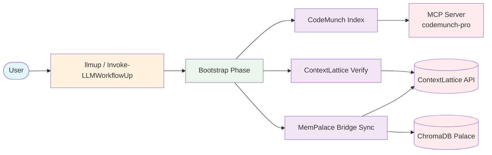
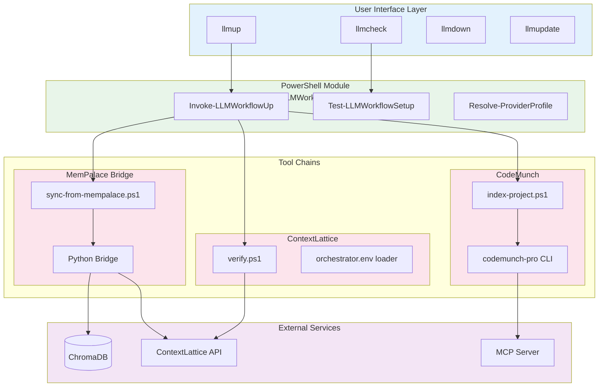
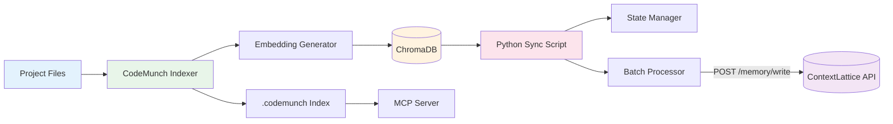
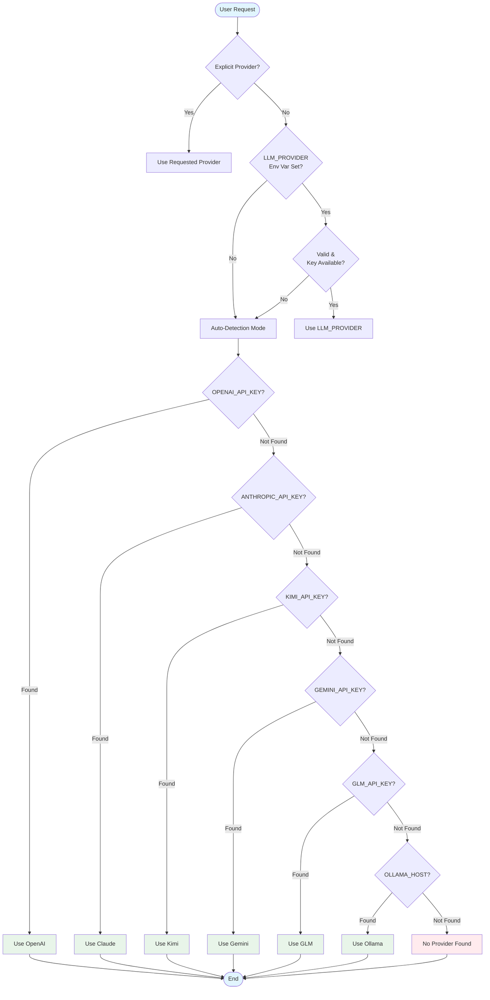
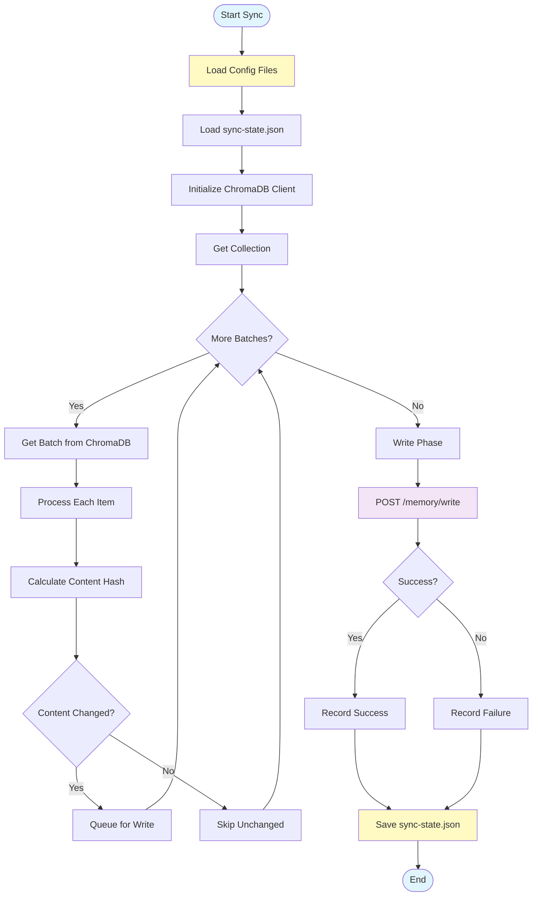

# CodeMunch + ContextLattice + MemPalace (All-in-One)

Canonical toolkit repo for the integrated workflow:

- `CodeMunch Pro` project indexing and MCP wrapper setup
- `ContextLattice` project bootstrap + connectivity verification
- `MemPalace -> ContextLattice` incremental bridge
- one global command to bootstrap any repo in one shot

## Why Use This Toolkit?

### For AI-Assisted Development
- **Unified Workflow**: One command (`llmup`) sets up everything needed for AI-assisted coding
- **Memory Persistence**: MemPalace remembers context across sessions via ChromaDB
- **Multi-Provider Support**: Seamlessly switch between OpenAI, Claude, Kimi, Gemini, GLM, and Ollama
- **Context Synchronization**: Automatic sync from local memory to ContextLattice API

### For Game Development
- **Game Presets**: `llmup -GameTeam` scaffolds complete game projects
- **Asset Management**: Built-in license tracking for art, audio, and code assets
- **Jam Mode**: Fast iteration with `-JamMode` for game jams and prototypes
- **GDD Templates**: Auto-generate Game Design Documents with structured sections

### For DevOps & CI/CD
- **Docker Support**: Full containerization with `Dockerfile` and `docker-compose.yml`
- **JSON Output**: `-AsJson` flag for machine-readable pipeline integration
- **Offline Mode**: `-Offline` for air-gapped environments
- **Cross-Platform**: Windows, Linux, and macOS support via PowerShell Core

### For Teams
- **Self-Healing**: `llmheal` automatically diagnoses and fixes common setup issues
- **Schema Validation**: JSON Schema ensures config correctness with IDE autocomplete
- **Plugin Architecture**: Extend with custom tools via `.llm-workflow/plugins.json`
- **Troubleshooting Guide**: Comprehensive docs for common issues

### Key Benefits

| Benefit | Feature | Command |
|---------|---------|---------|
| **One-Command Setup** | Bootstrap entire toolchain | `llmup` |
| **Visual Health Check** | Interactive TUI dashboard | `llmdashboard` |
| **Auto-Repair** | Self-healing diagnostics | `llmheal` |
| **Multi-Palace** | Sync multiple memory stores | `llmsync` |
| **Game Dev Ready** | Game templates & asset tracking | `llmup -GameTeam` |
| **Extensible** | Plugin system for custom tools | `llmplugins` |
| **Portable** | Docker containers for any environment | `docker-compose up` |
| **Safe** | Schema validation & drift detection | Built-in |

## Architecture

### Overview

The LLM Workflow system provides a unified bootstrap experience for integrating CodeMunch, ContextLattice, and MemPalace toolchains.



### Component Architecture



### Data Flow



### Provider Resolution Flow



### Sync Process Flow



For detailed architecture documentation, see [docs/ARCHITECTURE.md](docs/ARCHITECTURE.md).

## Repository layout

- `tools/codemunch`
- `tools/contextlattice`
- `tools/memorybridge`
- `tools/workflow`

`tools/workflow` contains the global installer and unified bootstrap command.

## Option A: Script install (global command)

From this repo:

```powershell
.\tools\workflow\install-global-llm-workflow.ps1
```

Open a new PowerShell session.

## Option B: Versioned module install (recommended)

From this repo:

```powershell
.\install-module.ps1
```

Then in any project folder:

```powershell
Invoke-LLMWorkflowUp
```

Alias:

```powershell
llmup
```

Optional (from module):

```powershell
Install-LLMWorkflow
Get-LLMWorkflowVersion
Test-LLMWorkflowSetup -ProjectRoot .
Update-LLMWorkflow
```

This installs the same global launcher under `~/.llm-workflow`.

Uninstall:

```powershell
Uninstall-LLMWorkflow
# alias
llmdown
```

Other aliases:

```powershell
llmcheck     # Test-LLMWorkflowSetup
llmver       # Get-LLMWorkflowVersion
llmupdate    # Update-LLMWorkflow
llmdashboard # Show-LLMWorkflowDashboard (interactive TUI)
llmheal      # Invoke-LLMWorkflowHeal (self-healing)
```

### Interactive Dashboard

Launch the real-time health dashboard:

```powershell
llmdashboard
```

The dashboard provides:
- **Color-coded status indicators** (Green=OK, Yellow=WARN, Red=FAIL)
- **Live progress** as checks complete
- **Latency measurements** for network operations
- **Interactive controls**: Press `R` to re-run, `Q` to quit, `A` to toggle auto-refresh

For CI/CD environments, use the `-NoInteractive` flag for plain-text output:

```powershell
Show-LLMWorkflowDashboard -NoInteractive
```

With ContextLattice connectivity checks:

```powershell
llmdashboard -CheckContext
```

### Self-Healing (llmheal)

Automatically diagnose and fix common issues:

```powershell
# Interactive diagnosis and repair
llmheal

# Preview what would be fixed
llmheal -WhatIf

# Auto-apply all fixes
llmheal -Force
```

Repairs include: creating missing .env files, installing ChromaDB, fixing Python paths,
creating palace directories, and more. See [docs/SELF_HEALING.md](docs/SELF_HEALING.md) for details.

## Use in any project

From any repo folder (script or module path):

```powershell
llm-workflow-up
```

Alias:

```powershell
llmup
```

Strict end-to-end check:

```powershell
llm-workflow-check
```

Diagnostics:

```powershell
llm-workflow-doctor -CheckContext
```

## Troubleshooting

See [docs/TROUBLESHOOTING.md](docs/TROUBLESHOOTING.md) for detailed troubleshooting guidance, including:

- Quick diagnostics with `llmcheck` and `llmheal`
- Common issues (Python, ContextLattice, MemPalace, API keys)
- Error message reference
- Diagnostic commands (`-AsJson`, `-Strict`, doctor script)
- How to collect logs for bug reports

Quick fixes:

```powershell
# Reinstall dependencies
python -m pip install --upgrade chromadb codemunch-pro

# Reset sync state
Remove-Item .memorybridge/sync-state.json -Force

# Full diagnostic check
llm-workflow-doctor -CheckContext -Strict
```

What it does:

1. Loads `.env` and `.contextlattice/orchestrator.env` when present.
2. Auto-creates missing tool folders in the current project:
   - `tools/codemunch`
   - `tools/contextlattice`
   - `tools/memorybridge`
3. Installs/validates dependencies (`codemunch-pro`, `chromadb`).
4. Runs project bootstrap scripts for all three toolchains.
5. Runs ContextLattice verify and MemPalace bridge dry-run (if API key exists).
6. Normalizes provider credentials for OpenAI/Kimi/Gemini/GLM switching.

## Optional flags

```powershell
llm-workflow-up -SkipDependencyInstall
llm-workflow-up -Provider glm
llm-workflow-up -Provider gemini
llm-workflow-up -Provider claude
llm-workflow-up -Provider ollama
llm-workflow-up -SkipContextVerify
llm-workflow-up -SkipBridgeDryRun
llm-workflow-up -SmokeTestContext
llm-workflow-up -SmokeTestContext -RequireSearchHit
llm-workflow-up -DeepCheck
llm-workflow-check -Provider kimi
llm-workflow-doctor -Provider auto -CheckContext -Strict
```

Supported providers: `openai`, `claude`, `kimi`, `gemini`, `glm`, `ollama`

## Plugin Architecture

Third-party tools can register as plugins via `.llm-workflow/plugins.json`.

### Plugin Manifest (`.llm-workflow/plugins.json`)

```json
{
  "version": "1.0",
  "plugins": [
    {
      "name": "code-review-agent",
      "description": "AI-powered code review automation",
      "bootstrapScript": "tools/code-review/bootstrap.ps1",
      "checkScript": "tools/code-review/check.ps1",
      "runOn": ["bootstrap", "check"]
    }
  ]
}
```

### Registering Plugins

Via module functions:

```powershell
# Register from a manifest file
Register-LLMWorkflowPlugin -ManifestPath "tools/my-plugin/manifest.json"

# Register inline
Register-LLMWorkflowPlugin -Name "my-plugin" -Description "My plugin" `
    -BootstrapScript "tools/my-plugin/bootstrap.ps1" `
    -RunOn @("bootstrap")

# List registered plugins
Get-LLMWorkflowPlugins

# Unregister a plugin
Unregister-LLMWorkflowPlugin -Name "my-plugin"
```

### Plugin Triggers

- `"bootstrap"` - Runs during `Invoke-LLMWorkflowUp` / `llmup`
- `"check"` - Runs during `Test-LLMWorkflowSetup` / `llmcheck`

### Plugin Script Interface

Plugins receive these parameters:

```powershell
param(
    [string]$ProjectRoot = ".",
    [hashtable]$Context = @{}
)
```

### Example Plugin

See `module/LLMWorkflow/templates/plugins/example-plugin/` for a complete example.

To use the example plugin:

```powershell
# Copy to your project
Copy-Item -Recurse "module/LLMWorkflow/templates/plugins/example-plugin" "tools/"

# Register it
Register-LLMWorkflowPlugin -ManifestPath "tools/example-plugin/manifest.json"

# Run bootstrap (includes plugins)
Invoke-LLMWorkflowUp

# Check will include plugin health checks
Test-LLMWorkflowSetup
```

## Notes

- Keep secrets in local `.env` files and never commit them.
- For ContextLattice auth, set `CONTEXTLATTICE_ORCHESTRATOR_API_KEY` in `.env`
  or `.contextlattice/orchestrator.env`.

## Docker Usage

The LLM Workflow Toolkit is available as a Docker container for CI/CD pipelines and containerized deployments.

### Quick Start with Docker

```bash
# Build the image
docker build -t llm-workflow .

# Run llmup in current project directory
docker run -v $(pwd):/workspace -e OPENAI_API_KEY llm-workflow

# Run setup check
docker run -v $(pwd):/workspace llm-workflow llmcheck

# Interactive shell
docker run -it -v $(pwd):/workspace llm-workflow shell
```

### Docker Compose

For full-stack deployment with ChromaDB and optional Ollama:

```bash
# Start all services
docker-compose up -d

# Run workflow
docker-compose run --rm llm-workflow

# With specific provider
docker-compose run --rm llm-workflow llmup

# View logs
docker-compose logs -f llm-workflow

# Stop all services
docker-compose down
```

### Environment Variables

Pass API keys and configuration via environment variables:

| Variable | Description | Required |
|----------|-------------|----------|
| `OPENAI_API_KEY` | OpenAI API key | Optional |
| `ANTHROPIC_API_KEY` | Claude/Anthropic API key | Optional |
| `KIMI_API_KEY` | Moonshot/Kimi API key | Optional |
| `GEMINI_API_KEY` | Google Gemini API key | Optional |
| `GLM_API_KEY` | Zhipu GLM API key | Optional |
| `CONTEXTLATTICE_ORCHESTRATOR_URL` | ContextLattice URL | Optional |
| `CONTEXTLATTICE_ORCHESTRATOR_API_KEY` | ContextLattice API key | Optional |
| `MEMPALACE_PALACE_PATH` | MemPalace storage path | Optional |

### Volume Mounts

| Path | Purpose | Persistence |
|------|---------|-------------|
| `/workspace` | Project files | Mount your project directory |
| `/data/mempalace` | ChromaDB data | Persistent volume |

### Available Commands

```bash
# Default (runs llmup)
docker run -v $(pwd):/workspace llm-workflow

# Specific commands
docker run -v $(pwd):/workspace llm-workflow llmup
docker run -v $(pwd):/workspace llm-workflow llmcheck
docker run -v $(pwd):/workspace llm-workflow llmver
docker run -v $(pwd):/workspace llm-workflow doctor

# Interactive shells
docker run -it -v $(pwd):/workspace llm-workflow shell   # Bash
docker run -it -v $(pwd):/workspace llm-workflow pwsh    # PowerShell
```

### CI/CD Pipeline Example

```yaml
# .github/workflows/docker-llm.yml
name: LLM Workflow

on: [push, pull_request]

jobs:
  llm-workflow:
    runs-on: ubuntu-latest
    steps:
      - uses: actions/checkout@v4
      
      - name: Run LLM Workflow
        uses: docker://llm-workflow:latest
        with:
          args: llmup
        env:
          OPENAI_API_KEY: ${{ secrets.OPENAI_API_KEY }}
          
      - name: Validate Setup
        uses: docker://llm-workflow:latest
        with:
          args: llmcheck
```

### Building Custom Images

```dockerfile
# Dockerfile.custom
FROM llm-workflow:latest

# Add custom tools
COPY my-tools/ /opt/llm-workflow/custom-tools/

# Pre-configure environment
ENV LLM_PROVIDER=openai
ENV OPENAI_BASE_URL=https://api.openai.com/v1

# Custom entrypoint
CMD ["llmup", "-SkipContextVerify"]
```

### Troubleshooting Docker

```bash
# Check container logs
docker logs llm-workflow

# Exec into running container
docker exec -it llm-workflow shell

# Verify installation inside container
docker run --rm llm-workflow llmver

# Debug with verbose output
docker run -v $(pwd):/workspace -e LLM_WORKFLOW_LOG_LEVEL=DEBUG llm-workflow
```

## Configuration Schema Validation

All configuration files include JSON Schema for IDE autocomplete and validation.

### Schema Files

| Config File | Schema File | Purpose |
|-------------|-------------|---------|
| `.memorybridge/bridge.config.json` | `bridge.config.schema.json` | MemoryBridge sync configuration |
| `.codemunch/index.defaults.json` | `index.defaults.schema.json` | CodeMunch indexing patterns |
| `.contextlattice/orchestrator.env` | `orchestrator.env.schema.json` | ContextLattice connection settings |

### IDE Integration

VS Code and other JSON-aware editors automatically provide:

- **Autocomplete**: Property names, values, and enums
- **Validation**: Real-time error detection for invalid types or patterns
- **Documentation**: Hover tooltips with descriptions and defaults
- **Snippets**: Quick insertion of common configuration patterns

To enable validation, ensure your config files include the `$schema` property:

```json
{
  "$schema": "./bridge.config.schema.json",
  "orchestratorUrl": "http://127.0.0.1:8075",
  ...
}
```

### Example: IDE Autocomplete Benefits

**Before schema (no validation):**
```json
{
  "orchestratorurl": "http://127.0.0.1:8075",
  "apikeyenvvar": "MY_KEY"
}
```
Issues: Typos in property names, no type checking, no documentation.

**After schema (with validation):**
```json
{
  "$schema": "./bridge.config.schema.json",
  "orchestratorUrl": "http://127.0.0.1:8075",
  "apiKeyEnvVar": "CONTEXTLATTICE_ORCHESTRATOR_API_KEY"
}
```
Benefits: 
- Property names autocomplete as you type
- URLs validated against pattern
- Enums show available options
- Hover shows field descriptions

### Manual Schema Validation

Validate a config file against its schema using `ajv-cli`:

```bash
# Install validator
npm install -g ajv-cli

# Validate config
ajv validate -s .memorybridge/bridge.config.schema.json -d .memorybridge/bridge.config.json
```

Or using Python:

```python
import json
from jsonschema import validate, ValidationError

with open('.memorybridge/bridge.config.schema.json') as f:
    schema = json.load(f)

with open('.memorybridge/bridge.config.json') as f:
    config = json.load(f)

try:
    validate(config, schema)
    print("Config is valid!")
except ValidationError as e:
    print(f"Validation error: {e.message}")
```

## Game Team Workflow

The LLM Workflow module includes a specialized preset for game development teams with GDD templates, asset management, and jam-optimized workflows.

### Quick Start for Game Projects

```powershell
# Initialize a game project with game team preset
llmup -GameTeam -GameTemplate "2d-platformer" -GameEngine "Godot"

# Or use jam mode for rapid prototyping
llmup -GameTeam -JamMode

# List available game templates
Get-LLMWorkflowGameTemplates
```

### Game Team Parameters

| Parameter | Description |
|-----------|-------------|
| `-GameTeam` | Activate game team preset with GDD, asset management, and task boards |
| `-GameTemplate` | Choose from: 2d-platformer, topdown-rpg, puzzle, fps-prototype, visual-novel, roguelike, card-game, endless-runner |
| `-GameEngine` | Engine being used (Unity, Godot, Unreal, etc.) |
| `-JamMode` | Enable fast iteration mode (sets ContinueOnError, lightweight artifacts) |

### Game Project Structure

When using `-GameTeam`, the following structure is created:

```
project-root/
├── docs/
│   ├── GDD.md                 # Game Design Document template
│   └── TASKS.md               # Task board (HacknPlan/Trello/GitHub compatible)
├── assets/
│   ├── ASSET_MANIFEST.json    # Asset tracking with license management
│   ├── sfx/                   # Sound effects
│   ├── music/                 # Background music
│   └── art/                   # Visual assets
└── .llm-workflow/
    └── game-preset.json       # Game preset configuration
```

### Game Design Document (GDD.md)

The GDD template includes sections for:

- **Elevator Pitch** - One-sentence hook and core fantasy
- **Core Loop** - The repeatable 30-second experience
- **Mechanics** - Primary/secondary systems, progression, failure states
- **Content Checklist** - Levels, characters, items, UI, audio, polish
- **Scope Boundaries** - MUST/SHOULD/NICE/WILL-NOT-HAVE lists
- **Technical Notes** - Engine version, dependencies, performance targets

### Asset Management

Track assets with license compliance:

```powershell
# Scan asset folders and update manifest
Export-LLMWorkflowAssetManifest -ScanFolders

# Export to CSV for spreadsheet tracking
Export-LLMWorkflowAssetManifest -Format csv -OutputPath "assets/manifest.csv"
```

Asset manifest tracks:
- File metadata (name, format, size, dimensions/duration)
- Source and license information (CC0, CC-BY, proprietary, etc.)
- Status (todo, wip, review, done)
- Assignment and tags

### Task Board (TASKS.md)

The task board template supports:

- **Kanban view** - To Do, In Progress, Blocked, Done
- **Category tracking** - Code, Art, Audio, Design
- **Time tracking** - Estimates vs actual hours
- **Multi-platform export**:
  - HacknPlan JSON import format
  - Trello CSV format
  - GitHub Projects checklist format

### Jam Mode

Optimized for game jams (48-72 hour sprints):

```powershell
llmup -GameTeam -JamMode
```

Jam Mode automatically:
- Sets `-ContinueOnError` (don't stop on minor issues)
- Skips bridge dry-run for faster setup
- Uses lightweight artifact reports
- Enables fast checks only

### Game Team Functions

```powershell
# Create game project structure
New-LLMWorkflowGamePreset -ProjectName "MyGame" -Template "2d-platformer" -Engine "Unity"

# List available templates
Get-LLMWorkflowGameTemplates

# Update asset manifest from scanned folders
Export-LLMWorkflowAssetManifest -ScanFolders

# Full game setup with all options
New-LLMWorkflowGamePreset -ProjectRoot "." -ProjectName "SpaceShooter" `
    -Template "topdown-rpg" -Engine "Godot" -JamMode
```

### Available Game Templates

| Template | Description | Suggested Engines |
|----------|-------------|-------------------|
| `2d-platformer` | Classic platformer with physics | Unity, Godot, GameMaker |
| `topdown-rpg` | Adventure/RPG with tile movement | Unity, Godot, RPGMaker |
| `puzzle` | Grid or physics puzzle | Any |
| `fps-prototype` | First-person shooter mechanics | Unity, Unreal, Godot |
| `visual-novel` | Story-focused with branching | RenPy, Unity |
| `roguelike` | Procedural dungeon crawler | Unity, Godot |
| `card-game` | Digital card game | Unity, Godot |
| `endless-runner` | Auto-scrolling arcade | Unity, Godot |

## Testing

```powershell
Install-Module Pester -Scope CurrentUser -Force -SkipPublisherCheck
Invoke-Pester -Path .\tests -Output Detailed
```

CI workflow:

- `.github/workflows/ci.yml`
- `.github/workflows/gitleaks.yml`
- `.github/workflows/codeql.yml`
- `.github/workflows/release.yml`
- `.github/workflows/publish-gallery.yml`
- `.github/workflows/supply-chain.yml`

CI guard scripts:

- `tools/ci/check-template-drift.ps1`
- `tools/ci/validate-compatibility-lock.ps1`

Compatibility lock:

- `compatibility.lock.json`

## Release

```powershell
.\tools\release\bump-module-version.ps1 -Version 0.2.1
git add .
git commit -m "Release 0.2.1"
.\tools\release\create-release-tag.ps1 -Push
```

PowerShell Gallery publish is automated on GitHub Release publish when
`PSGALLERY_API_KEY` is configured in repo secrets.
